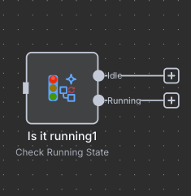
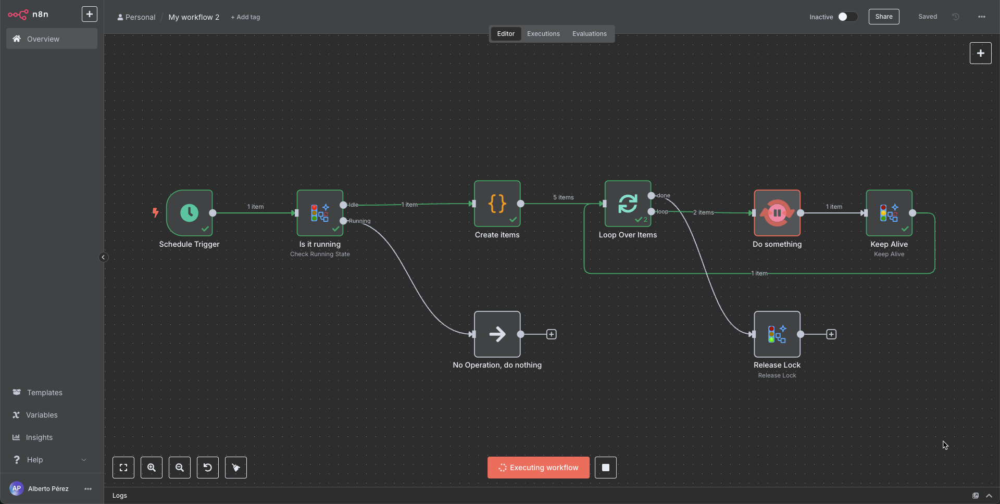
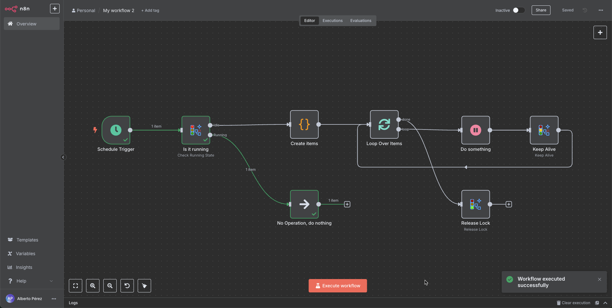
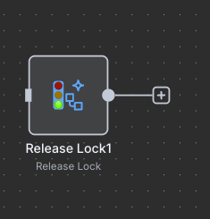
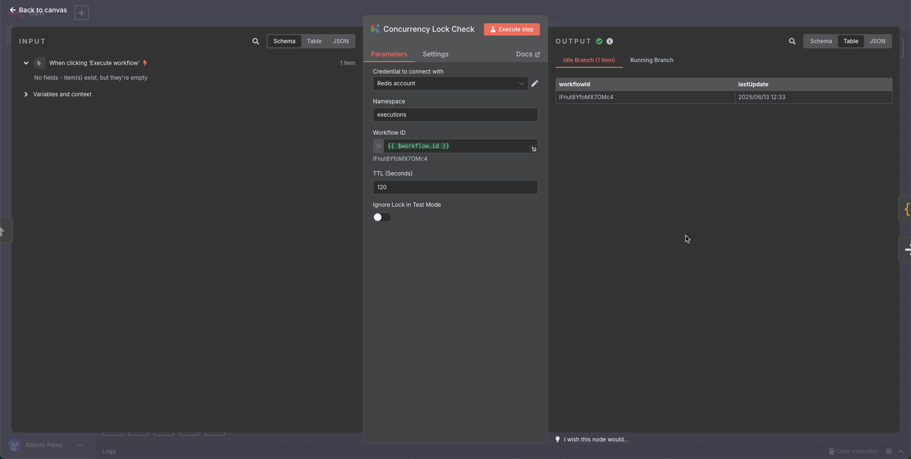
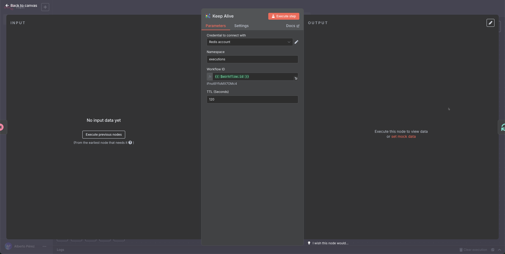
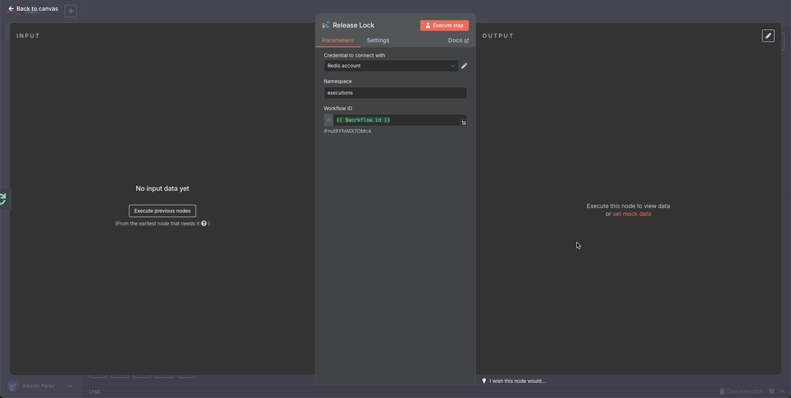

# Concurrency Lock Nodes for n8n

A set of n8n nodes that manage workflow concurrency using Redis locks. Prevent workflows from running simultaneously by implementing distributed locks.

## Features

- **Concurrency Control**: Prevent multiple instances of the same workflow from running at the same time
- **Redis-based**: Implements distributed locks using Redis for reliability across distributed systems
- **Simple Configuration**: Easy to set up and use with minimal configuration
- **Test Mode Support**: Option to bypass locks during test executions
- **Auto-Expiring Locks**: Uses Redis TTL to prevent indefinite locks if a workflow crashes

## Installation

To install the custom nodes:

1. **Manual installation**:

   ```bash
   cd ~/.n8n/custom
   git clone https://github.com/aperezmad/n8n-nodes-concurrencylock.git 
   ```

2. **Restart n8n**:
   ```bash
   n8n restart
   ```

For more detailed instructions on installing custom nodes, refer to the [official n8n documentation on custom nodes](https://docs.n8n.io/integrations/community-nodes/installation/).

## How It Works

The package consists of three specialized nodes that work together to implement concurrency control. All nodes leverage Redis TTL (Time-To-Live) functionality to ensure that even if a workflow crashes or terminates abnormally, the lock will automatically expire after a configurable period, preventing indefinite blockage of workflow execution.

### 1. Concurrency Lock Check



**Check if workflow is already running:**

- "Idle" output: First instance, proceed with execution
- "Running" output: Another instance is already running

This node checks if a workflow is already running by attempting to acquire a lock:

- If the lock doesn't exist (workflow isn't running elsewhere), it creates the lock and outputs to "Idle"
- If the lock exists (workflow is already running), it outputs to "Running"

This node is typically placed at the beginning of your workflow:



When a second instance of the workflow tries to run while the first is still executing, it will exit via the "Running" output:



### 2. Concurrency Lock Keep Alive


**Updates lock expiration time:**  
Prevents timeout during long-running operations

Periodically updates the lock's timestamp to prevent it from expiring during long-running workflows:

- Use this node in loops or long-running operations
- Keeps the lock active as long as the workflow is running
- Resets the TTL countdown to avoid automatic expiration while workflow is still processing

### 3. Concurrency Lock Release



**Manually removes lock:**  
Allows new workflow instances to start running

Manually releases the lock, allowing other instances of the workflow to run:

- Use at the end of your workflow or in error handlers
- Good practice to release locks even though they auto-expire with TTL
- Ensures immediate availability for the next execution

### See this node in action

[](https://youtu.be/e3aCK12PBrk)


## Configuration Options

### Concurrency Lock Check



- **Namespace**: Group for related locks (default: "executions")
- **Workflow ID**: Unique identifier (default: current workflow ID)
- **TTL (Seconds)**: Lock expiration time (default: 120s)
- **Ignore Lock in Test Mode**: Allows execution during tests (default: false)

### Concurrency Lock Keep Alive



- **Namespace**: Group for related locks (default: "executions")
- **Workflow ID**: Unique identifier (default: current workflow ID)
- **TTL (Seconds)**: Reset lock expiration time (default: 120s)

### Concurrency Lock Release



- **Namespace**: Group for related locks (default: "executions")
- **Workflow ID**: Unique identifier (default: current workflow ID)

## Redis Configuration

All nodes require Redis credentials to be configured. Create a credential of type "Redis" with:

- Host
- Port
- Password (if applicable)

## Use Cases

- **Scheduled Workflows**: Prevent overlapping executions of scheduled workflows
- **Resource Management**: Control access to limited resources
- **Data Processing**: Ensure data is processed exactly once
- **API Rate Limiting**: Coordinate access to rate-limited APIs across multiple workflows

## License

MIT

## Author

Alberto Pérez (aperez@brujuleo.es)

## Support

For issues, feature requests, or questions, please [create an issue](https://github.com/<username>/n8n-nodes-flow-running/issues).
